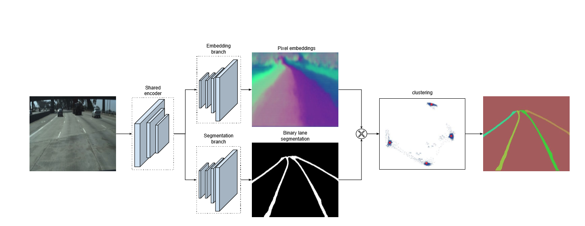

# Deep Learning Lane Detection

## Repo 结构：

    |
    |----README.md
    |
    |----model.py: Network definition
    |
    |----loss.py: implementation of discriminative loss
    |
    |----preprocess.py: create required dataset from uncompressed tusimple data
    |
    |----train.py: model training pipline
    |
    |----Data.py： pytorch dataset definition
    |
    |----clustering.py: posprocess procedures
    |
    |----logs/
    |------|------models/: save serialized model pickle files
    |------|------loggings/: save trainig logs
    |
    |----data/
    |------|------cluster/: store instance segemntation ground-truth
    |------|------train_binary/:store semantic-segmentation ground-truth
    |------|------LaneImages/:store raw RGB images
    |
    |----test_result/
    |------|-----fitted/:store test results with curve fitting 
    |------|-----instance/:store instance segmentation test results
    |
    |----test_images/---store sample test images

## Network architecture

## Examples

## Usage
### predict on test images
1. Download trained pytorch model pickled from [model](https://drive.google.com/open?id=1zfmPUWVWYhmbkI3g9lOUiG_li8iPiN12)
2. run test.py to produce segmented images in test_result/fitted and test_result/instance folders
### train on tusimple data
1. Download tusimple dataset from [link](https://github.com/TuSimple/tusimple-benchmark/issues/3) and decompress
2. run preprocess.py to create usable datasets
3. run train.py to perform training

